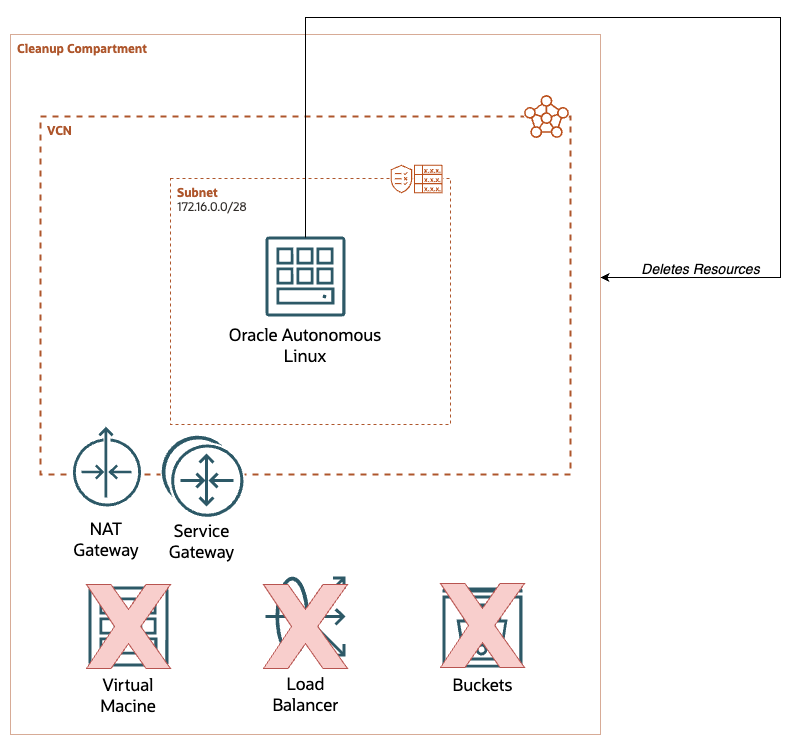

# Deploy OCIExtirpater



## Using Oracle Resource Manager

1. Click the "Deploy to Oracle Cloud" button and log into your tenancy.
2. Select compartment to deploy OCIExtirpater resources (Oracle Autonomous Linux Instance, etc.) in.
3. Select compartment to extirpate (Not the same compartment as resources to be deployed in!).
4. Optionally change the label to be applied to resources created by the stack.
5. Add one or more SSH keys for shell access to the Extirpater instance if needed.
6. Optionally select if you want to use a pre-existing VCN and Subnet.
7. Save and Apply the Stack.

## Variables

| Variable | Type | Required (ORM) | Required (Other Method) | Description |
| --- | --- | --- | --- | --- |
| tenancy_ocid | String |  | :white_check_mark: | OCID of the tenancy to deploy Extirpater |
| user_ocid | String |  | :white_check_mark: | OCID of user principal deploying Extirpater |
| private_key_path | String |  | :white_check_mark: | Path to private key associated with user principal |
| fingerprint | String |  | :white_check_mark: | Fingerprint of key associated with user principal |
| private_key_password | String |  |  | Password for private key associated with user principal |
| region | String |  | :white_check_mark: | OCI Region to deploy Extirpater in |
| cleanup_compartment | String | :white_check_mark: | :white_check_mark: | Compartment to Extirpate (delete stuff) |
| label | String |  |  | Label to apply to resources deployed by Extirpater |
| ssh_public_key | String |  |  | SSH public key to add to Oracle Autonomous Linux instance running Extirpater |
| use_existing_network | Boolean |  |  | Flag to deploy solution to existing network |
| existing_vcn | String |  |  | OCID of OCI Virtual Cloud Network to deploy Extirpater resources in (**Required if use_existing_network is true**) |
| existing_subnet | String |  |  | OCID of Subnet in VCN to deploy Extirpater resources in (**Required if use_existing_network is true**) |

## Instance Info

An Oracle Autonomous Linux 9 instance is deployed in a (by default) private subnet. An SSH key can be added by entering the public key in the `ssh_public_key` variable to enable shell access.

Exitirpater will run once a day at 00:00 to delete all resources, except compartments, from the chosen `extirpate_compartment`. Logs for these runs will be kept in `/var/log/ociextirpater`.

### Requirements

- One AMD EPYC E5 Flex instance with 1 OCPU and 8 Gb Memory
- One Dynamic Group on the Default Identity Domain
- One OCI Policy to give Dynamic Groups permissions on deletion compartment
- The Extirpater instance requires a Virtual Cloud Network (VCN) and subnet with either:

  - A NAT Gateway and Service Gateway for accessing updates, repository access, and control plane connectivity and associated route rules

  Or

  - An Internet Gateway with routes to the internet

## Using OCI's Native Terraform Backend

If deployment is being done with tools other than the Oracle Resource Manager, a few configurations can be added to [track state remotely in an OCI Object Storage Bucket](https://blogs.oracle.com/cloud-infrastructure/post/terraform-oci-state-locking-backend). This backend is state-locking so it can be utilized by multiple developers remotely. A sample configuration is provided in [`backend.tf`](./backend.tf); simply uncomment it and update the placeholders:

```HCL
terraform {
  backend "oci" {
    bucket         = "<state bucket name>"
    namespace      = "<object storage namespace>"
    region         = "<oci-region>"
    compartment_id = "<bucket compartment ocid>"
    key            = "<key_location>"
  }
}
```

Leave the block commented (default) when deploying with Oracle Resource Manager, since ORM manages state automatically.

## Troubleshooting

If the Extirpater instance is not working, SSH into the instance using a tool like _Cloud Shell_ and check the following logs to help diagnose the issue:

- /var/log/cloud-init.log
- /var/log/cloud-init-output.log
- /var/log/ociextirpater/*.log
