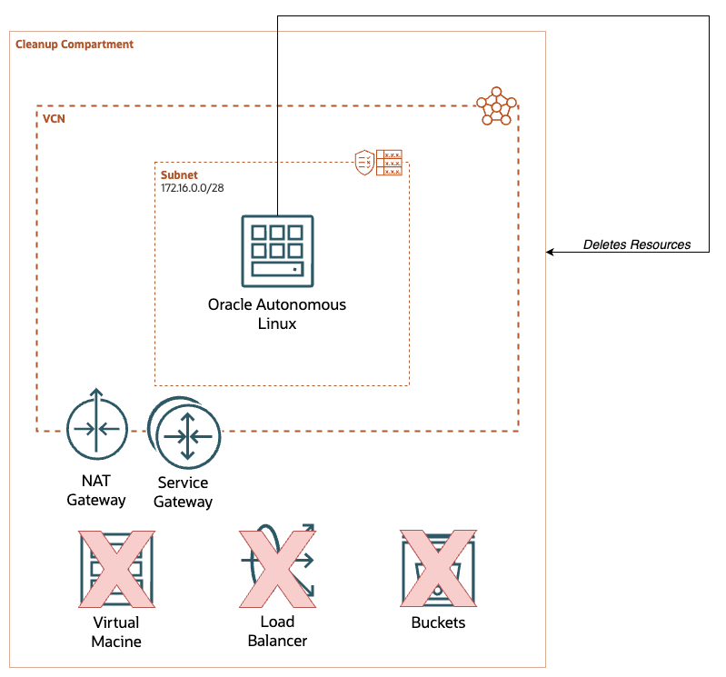

# Deploy OCIExtirpater

[](https://cloud.oracle.com/resourcemanager/stacks/create?zipUrl=https://github.com/therealcmj/ociextirpater/releases/download/v1.6.8/extirpater1.6.8.zip)



## Using Oracle Resource Manager

1. Click the "Deploy to Oracle Cloud" button and log into your tenancy.
2. Select compartment to deploy OCIExtirpater resources (Oracle Autonomous Linux Instance, etc.) in.
3. Select compartment to extirpate (Not the same compartment as resources to be deployed in!).
4. Optionally change the label to be applied to resources created by the stack.
5. Add one or more SSH keys for shell access to the Extirpater instance if needed.
6. Optionally select if you want to use a pre-existing VCN and Subnet.
7. Save and Apply the Stack.

## Variables

| Variable | Type | Required (ORM) | Required (Other Method) | Description |
| --- | --- | --- | --- | --- |
| tenancy_ocid | String |  | :white_check_mark: | OCID of the tenancy to deploy Extirpater |
| user_ocid | String |  | :white_check_mark: | OCID of user principal deploying Extirpater |
| private_key_path | String |  | :white_check_mark: | Path to private key associated with user principal |
| fingerprint | String |  | :white_check_mark: | Fingerprint of key associated with user principal |
| private_key_password | String |  |  | Password for private key associated with user principal |
| region | String |  | :white_check_mark: | OCI Region to deploy Extirpater in |
| cleanup_compartment | String | :white_check_mark: | :white_check_mark: | Compartment to Extirpate (delete stuff) |
| use_deployment_compartment | Boolean |  |  | Deploy Extirpater resources to a different compartment than `cleanup_compartment` |
| deployment_compartment | String |  |  | Compartment OCID for Extirpater resources (**Required if `use_deployment_compartment` is true**) |
| network_compartment | String |  |  | Optional compartment OCID for network resources (defaults to Extirpater resources compartment) |
| label | String |  |  | Label to apply to resources deployed by Extirpater |
| ssh_public_key | String |  |  | SSH public key to add to Oracle Autonomous Linux instance running Extirpater |
| use_existing_network | Boolean |  |  | Flag to deploy solution to existing network |
| existing_vcn | String |  |  | OCID of OCI Virtual Cloud Network to deploy Extirpater resources in (**Required if use_existing_network is true**) |
| existing_subnet | String |  |  | OCID of Subnet in VCN to deploy Extirpater resources in (**Required if use_existing_network is true**) |
| extirpater_tag | Map(String) |  |  | Freeform tags used to mark resources Extirpater should skip |

## Instance Info

An Oracle Autonomous Linux 9 instance is deployed in a (by default) private subnet. An SSH key can be added by entering the public key in the `ssh_public_key` variable to enable shell access.

Extirpater configures a daily cron job at `00:00` to delete all resources, except compartments, from the chosen `cleanup_compartment`. Logs for these runs are written to `/var/log/ociextirpater`.

Terraform also creates OCI Resource Scheduler schedules to start the instance at `23:45` and stop it at `05:45`, ensuring the instance is running before the `00:00` cleanup cron executes.

### Requirements

- One AMD EPYC E5 Flex instance with 1 OCPU and 6 Gb Memory
- One Dynamic Group on the Default Identity Domain
- One OCI Policy to give Dynamic Groups permissions on deletion compartment
- The Extirpater instance requires a Virtual Cloud Network (VCN) and subnet.
- If `use_existing_network = false` (default), Terraform creates a VCN and private subnet with a NAT Gateway and Service Gateway (plus route rules).
- If `use_existing_network = true`, Terraform uses your existing VCN/subnet values. In this case, Internet Gateway access is possible if you create and configure it in that existing network.

## Using OCI's Native Terraform Backend

If deployment is being done with tools other than the Oracle Resource Manager, a few configurations can be added to [track state remotely in an OCI Object Storage Bucket](https://blogs.oracle.com/cloud-infrastructure/post/terraform-oci-state-locking-backend). This backend is state-locking so it can be utilized by multiple developers remotely. A sample configuration is provided in [`backend.tf`](./backend.tf); simply uncomment it and update the placeholders:

```HCL
terraform {
  backend "oci" {
    bucket         = "<state bucket name>"
    namespace      = "<object storage namespace>"
    region         = "<oci-region>"
    compartment_id = "<bucket compartment ocid>"
    key            = "<key_location>"
    auth           = "APIKey"
  }
}
```

Leave the block commented (default) when deploying with Oracle Resource Manager, since ORM manages state automatically.

## Troubleshooting

If the Extirpater instance is not working, SSH into the instance using a tool like _Cloud Shell_ and check the following logs to help diagnose the issue:

- /var/log/cloud-init.log
- /var/log/cloud-init-output.log
- /var/log/ociextirpater/*.log
